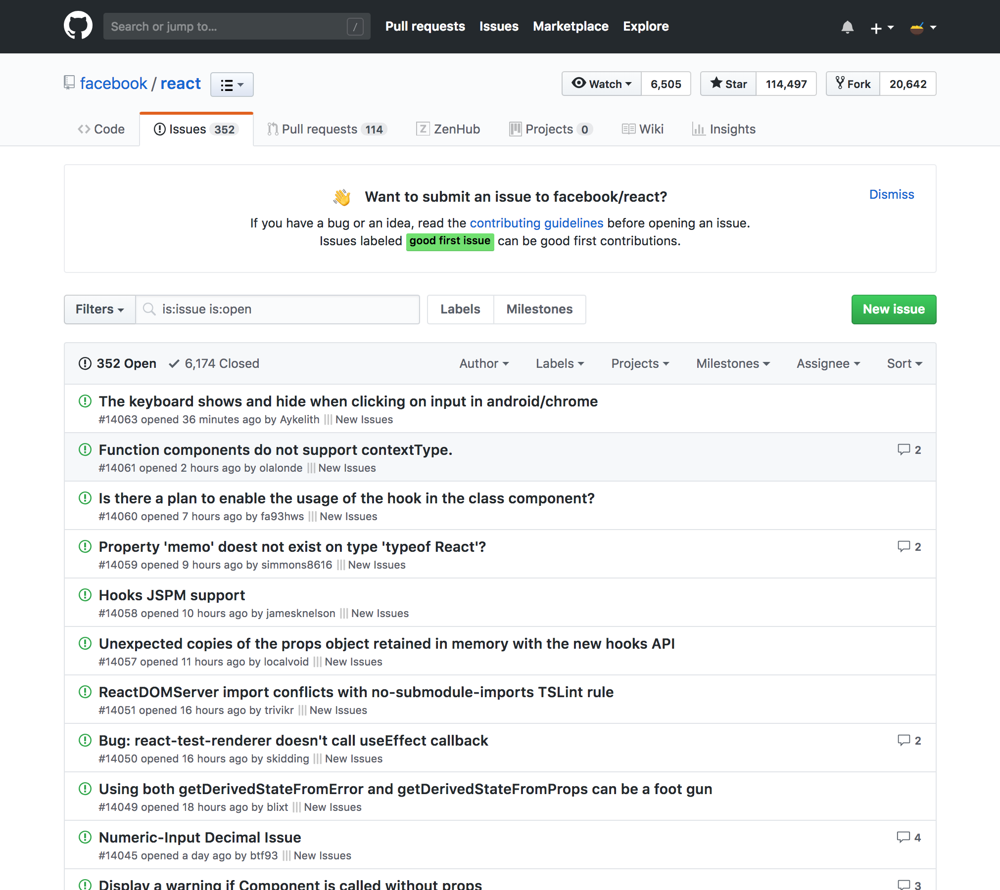
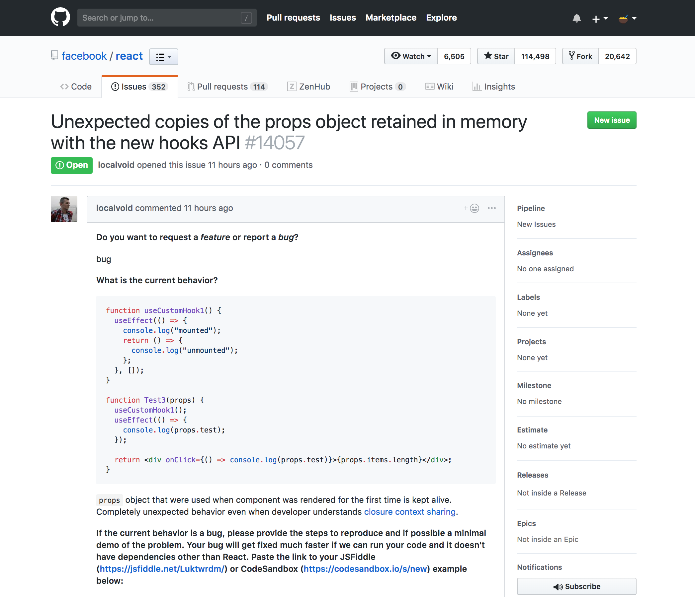

# Labo 2 - UI Component Design System

Components are great way to design and develop you UI using smaller, reusable pieces with better consistency. Companies like [Uber](https://www.uber.design/case-studies/rebrand), [Pinterest](https://pinterest.github.io/gestalt/#/), [Airbnb](https://airbnb.design/building-a-visual-language/) and many more achieve consistency in their UI through a component-based design system.

The objective of this project (part 1/2) is to get familiar with React and learn how to think in components by authoring a small UI Component Design System. 

In the next project (part 2/2) you'll use the components you built to create an actual app by adding data fetching with GraphQL and routing using React Router.

## Objectives

This lab might be your first experience with React or with a Javascript framework, so we'll keep the scope small. Make a really simplified version of Github’s Issues page. Just focus on implementing the list of issues, and ignore the stuff in the header (search, filtering, stars, etc).

Implement the issue detail page too. 

#### Step 1 - Set up your project

Don't waste too much time on scaffolding the project consider using some boilerplate like [create-react-app](https://facebook.github.io/create-react-app/)

Then, you'll need a tool that will help you implement a UI Component Design System. You can achieve this by adding [storybook](https://github.com/storybooks/storybook) to your project or any other similar library — check out [some examples](https://storybook.js.org/examples/).

#### Step 2 - Break The UI Into A Component Hierarchy

By analyzing Github's Issues page, you should be able to draw boxes around every components (and subcomponents). 

One such technique is the [single responsibility principle](https://en.wikipedia.org/wiki/Single_responsibility_principle), that is, a component should ideally only do one thing. If it ends up growing, it should be decomposed into smaller subcomponents.

#### Step 3 - Build presentational components

Presentational components are only concerned with *how things look*. They have no dependencies on the rest of your app. **They receive data and callbacks exclusively via props**. 

For example, you may have presentational components such as `<IssueListItem />`, `<Label />` or `<Button >`. 

Use storybook to build and document your components.

#### Step 4 - Deploy your UI Components Design System

If you're using storybook, check out this link to learn how to export your storybook as a static App and deploy it somewhere (like Github Pages): https://storybook.js.org/basics/exporting-storybook/#deploying-to-github-pages

## Resources

- Render the issue’s Markdown text and its comments using something like [react-markdown](https://github.com/rexxars/react-markdown).
- React components that implement Google's Material Design [material-ui](https://material-ui.com/)
- React UI library that follows the Ant Design specification [ant.design](https://ant.design/docs/react/introduce)

